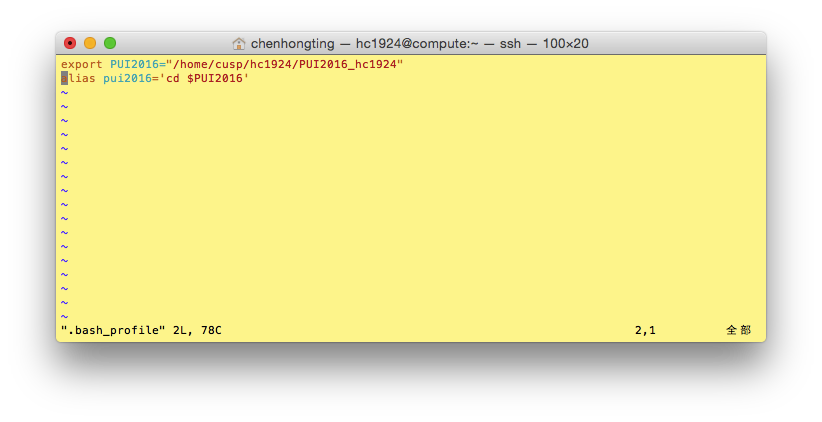
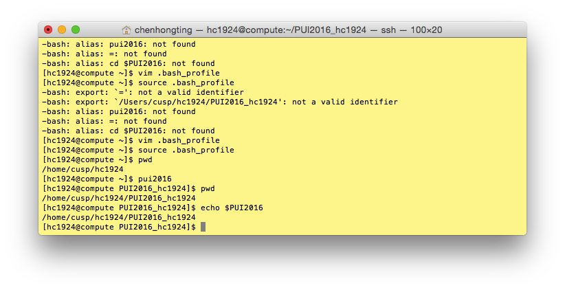

#hw1-Assignment 2
1. Access the compute

	```
	ssh hc1924@gw.cusp.nyu.edu
	```
	```
	ssh compute
	```
2. Create an environmental variable on my compute account call PUI2016 that points to the directory 
/home/cusp/hc1924/PUI2016_hc1924. Create an alia called pui2016 which takes to that directory in .bash_profile file:

3. Type commands to test the envionment set-up:

