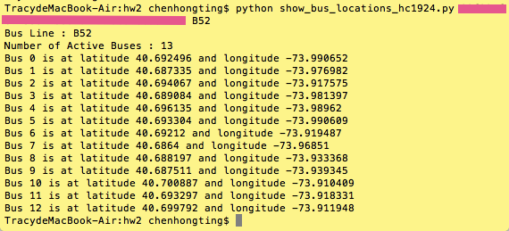
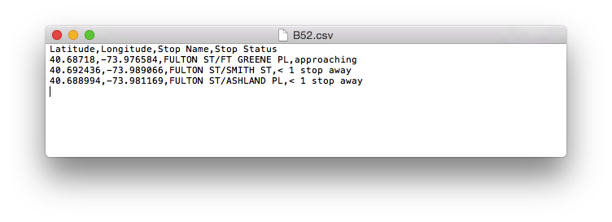

#HW2
HW2 is done independently by myself...
##HW2_Assignment 1
The test result is as follows:

##HW2_Assignment 2
The output file writes so slowly that it will take several minutes to see the results in the csv file. I may need to improve the method to write to a csv file...
The output sample is as follows:

##HW2_Assignment 3
The file isn't located exactly as the instructions tells, so I have to find out what is the specific path for the data I am using.

On compute I can't import seaborn module when I try to visualize the data and I don't have the authority to install it as I tried.