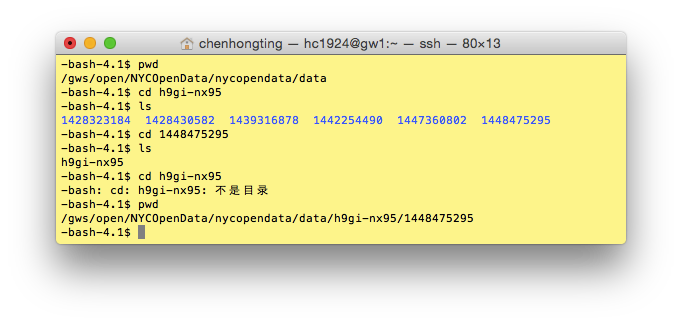

#HW2
HW2 is done independently by myself and the only difficulty I came across is the Extra Credid Assignment which made me dig into how to plot the dates in Panda.
##HW2_Assignment 1
The test result is as follows:

##HW2_Assignment 2
Sometimes the output file writes so slowly that it will take several minutes to see the results in the csv file. 
The output sample is as follows:

##HW2_Assignment 3
The dataset file isn't located exactly as the instructions tells, so I have to find out on terminal what is the specific path for the data I am using.

On compute I can't import seaborn module when I try to visualize the data and I don't have the authority to install it as I tried. When choosing a dataset from the CUSP DF for the assignment3, I found that so many dataset are not so useful to work with.