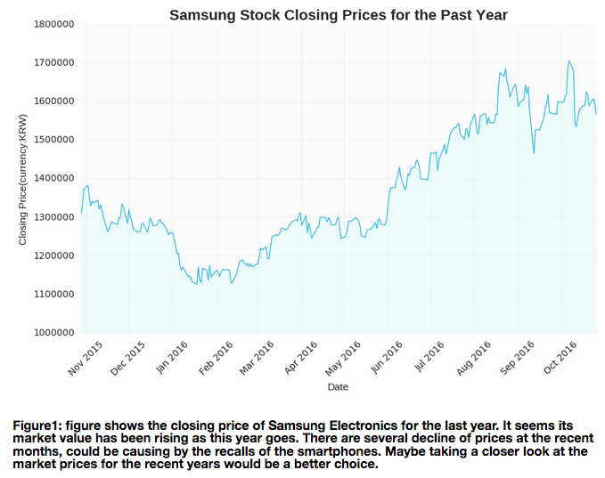

#HW7 Plot Review
### hc1924's plot
#### Review by Ben Alpert

###<b>Clarity:</b>
<i>Is the plot easy to read? is it clear or confusing, are the quantities being visualized ambiguous?</i>

The plot is easy to read. Both axes are labeled properly and the title makes it clear what is visualized. Using a filled area plot is a good choice to represent the stock price for Samsung. The data is easy to read, with clear fluctuations over the past year or so clearly represented. It would be helpful to add a currency symbol to the numbers on the Y axis. Right now, it's not clear without reading the Y axis label what currency the stock price is being measured in. 

###<b>Asthetic:</b>
<i>Beautiful is a subjective judgment: you should not judge the plot on the basis of whether you think it is "beautiful", but you should judge whether its esthetic is functional to what it is meant to communicate. Are the colors chosen appropriately? Are the graphical elements used appropriate to represent the quantities being visualized? Are the graphical choices allowing you to focus on the right elements or are they distracting you?</i>

The graph's asthetic is well selected. It's easy to see what's being measured and visualized. I am able to focus on the data given the color scheme and representation. 

###<b>Honesty:</b>
<i>Is the plot honestly reproducing the data or is it deforming it, perhaps to emphasize a point?</i>

The plot strikes me as honest. In class, we discussed whether zooming in to the data might, in some cases, create the false impression of drastic fluctuations. The graph here is zoomed in, with a minimum stock price of 1,000,000 KRW. After reviewing stock price charts though, this appears to be the standard. The drop described in the analysis as resulting from the recent recall of smartphones might be overstated though, given this zoom.

###<b>Suggestions:</b>

I think that including a trend line or fitting a curve to the graph could make this graph even more interesting. Clearly, the price has increased over the past year or so, but a trend line would help draw conclusions about the pace of the increase. 
