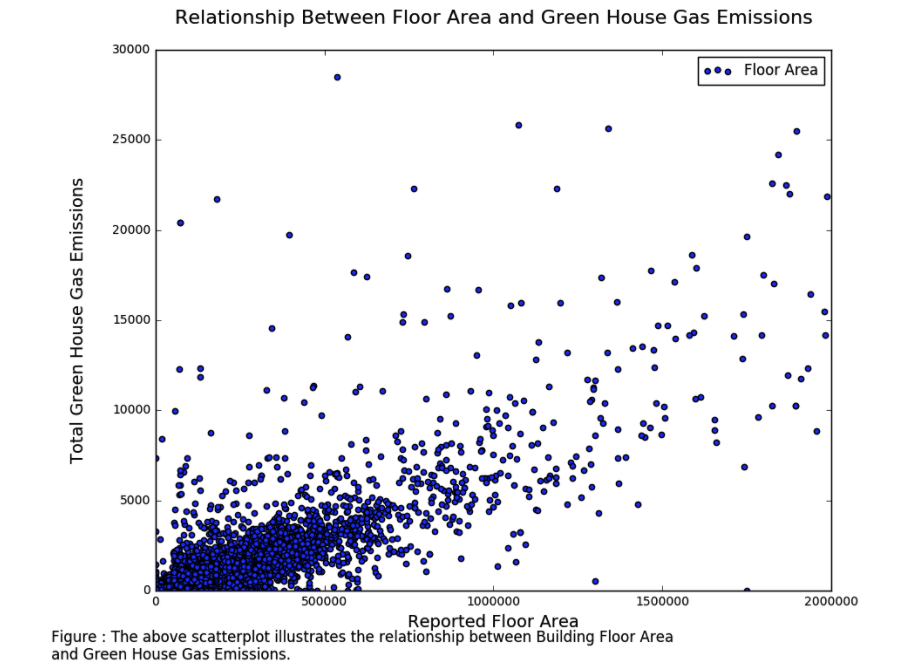

Review for mal824

This plot is easy to read with clear title, axis labels and captions. However the default color of the dots are kind of dull. Since most of the data points are packed at the left corner, I would suggest to add transparency to show the density. Besides, taking a closer look at the dense data points by zooming in the plot would be a good idea. We can more or less see a linear relation from the plot so I would suggest to fit a line to the data points to present more information about the correlation of the variables and add them to the caption. The legend shows the data points stand for Floor Area which is not the case. There are data points of gas emission per floor area. And both the X axis and Y axis need units to the scale(square meter for floor area, kwh for gas emissions)
