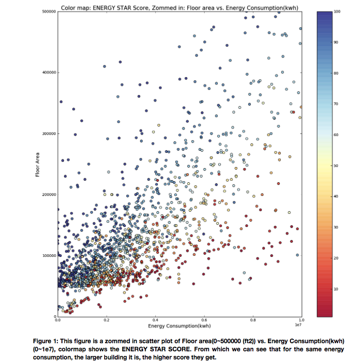

Review for xy1002

This plot is easy to read with clear title, axis labels and captions. The colormap is very beautiful and clear to show the Energy Star score. But from my stand point, I have no idea what the Energy Star score stands for. What’s more, “For the same energy consumption, the larger building it is, the higher score they get.” I would suggest it makes more sense to switch the x axis(Energy Consumption) and y axis(Floor Area) and compare the energy star score to the same floor area of the buildings. Besides, the y axis needs a unit(square meter for floor area) to the scale like the x axis(kwh for energy consumption). 
